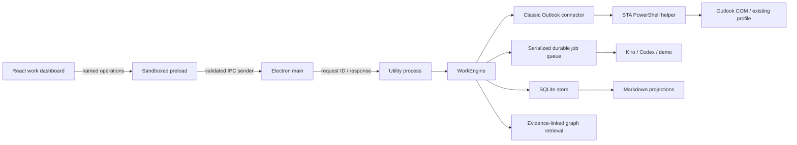

# DeepWork architecture

This describes the implemented Windows-first application. Read [product intent](PRODUCT_ARCHITECTURE.md) for why it exists and [integration contracts](INTEGRATION_CONTRACTS.md) for payload examples. Implemented code is distinct from a verified production integration: Outlook COM and real organization CLI runs still require the Windows checks in [WINDOWS_SETUP.md](WINDOWS_SETUP.md).

## Component map



| File                                                                | Responsibility                                                                          | Does not own                              |
| ------------------------------------------------------------------- | --------------------------------------------------------------------------------------- | ----------------------------------------- |
| [src/App.tsx](../src/App.tsx)                                       | Work views, task selection, user actions, polling snapshots                             | Persistence, AI execution, mailbox access |
| [src/components/TaskEditor.tsx](../src/components/TaskEditor.tsx)   | Revision-checked manual corrections to task details                                     | Applying AI suggestions                   |
| [src/components/Settings.tsx](../src/components/Settings.tsx)       | User preferences and CLI configuration                                                  | Credentials or authentication flows       |
| [src/components/MemoryFact.tsx](../src/components/MemoryFact.tsx)   | Review, correct, deactivate graph facts                                                 | Inferring new facts                       |
| [src/components/Markdown.tsx](../src/components/Markdown.tsx)       | Render derived content without loading external images                                  | Navigation or executable HTML             |
| [src/lib/workTypes.ts](../src/lib/workTypes.ts)                     | Renderer-facing TypeScript models                                                       | Runtime validation                        |
| [electron/preload.ts](../electron/preload.ts)                       | Small request API over IPC                                                              | Shell/filesystem access                   |
| [electron/main.ts](../electron/main.ts)                             | Window, sender validation, utility-process RPC, workspace selection and lifecycle       | Task business rules                       |
| [service/worker.cjs](../service/worker.cjs)                         | Service startup, request dispatch, shutdown                                             | Presentation                              |
| [service/core/contracts.cjs](../service/core/contracts.cjs)         | Preferences, normalized mail, task statuses, output schema, runtime validation          | Provider flags                            |
| [service/core/engine.cjs](../service/core/engine.cjs)               | Task rules, ingestion, job queue, reconciliation, revision checks, review, audit events | COM implementation                        |
| [service/core/store.cjs](../service/core/store.cjs)                 | SQLite records and atomic file persistence                                              | AI or task interpretation                 |
| [service/core/memory.cjs](../service/core/memory.cjs)               | Bounded evidence-linked graph retrieval                                                 | A model or remote vector service          |
| [service/core/markdown.cjs](../service/core/markdown.cjs)           | Rebuildable brief, task/thread/graph/weekly projections and generated-file cleanup      | Accepting edited Markdown as task state   |
| [service/connectors/outlook.cjs](../service/connectors/outlook.cjs) | Bounded helper invocation and temporary response handling                               | Organization CLI behavior                 |
| [service/connectors/outlook.ps1](../service/connectors/outlook.ps1) | Classic Outlook COM, folder pages, source opening, SMTP recipient normalization         | Model calls, task mutations, sending      |
| [service/connectors/demo.cjs](../service/connectors/demo.cjs)       | Synthetic mail and deterministic demo provider                                          | Live email processing                     |
| [service/providers/process.cjs](../service/providers/process.cjs)   | Argument-vector spawning, stdin, output limits, timeout/cancellation, Unicode decoding  | Prompt construction                       |
| [service/providers/cli.cjs](../service/providers/cli.cjs)           | Common prompt, Codex schema/artifact adapter, Kiro ACP adapter, native/WSL launch       | Applying unvalidated output               |

## One sync, end to end

```mermaid
sequenceDiagram
  participant User
  participant UI
  participant Engine
  participant Outlook
  participant CLI
  participant Store
  User->>UI: Sync mail
  UI->>Engine: enqueue sync
  Engine->>Store: persist queued job
  Engine->>Outlook: read configured local-client pages
  Outlook-->>Engine: normalized mail + warnings + next cursor
  Engine->>Store: save sources; expose VIP/manager messages
  Engine->>Store: enqueue unprocessed classification jobs
  Engine->>CLI: relevant messages, candidate tasks, goals, graph evidence
  CLI-->>Engine: structured proposals and cited facts
  Engine->>Engine: validate IDs, excerpts, goals, source versions, task revisions
  Engine->>Store: atomic task/fact/proposal/job update
  Engine->>Store: rebuild Markdown projections
  UI->>Engine: poll snapshot
  Engine-->>UI: tasks, priority mail, review proposals, job states
```

VIP and manager visibility is deterministic from configured sender addresses. It does not wait for AI. An incomplete extraction page is explicitly shown; unreadable messages are reported. Scan cursors rotate among folders and tracked conversations and advance through overlapping pages. They are best-effort local enumeration offsets, not a server delta protocol. Mailbox reordering can require a wraparound rescan. Changing the lookback or folder selection resets scan cursors. No periodic scheduler is included: the user starts each sync page.

Messages are identified by account plus Internet Message-ID when available, falling back to provider ID. Subject is never an identity key. COM EntryID and StoreID are retained for opening the original item. Moves update source locations without deleting work. Deletions are not inferred from a capped scan; tasks remain until a user or reviewed proposal changes them.

Open tasks define tracked conversations. The connector attempts older-thread retrieval only in configured folders and reports unsupported queries. Messages missing from the local profile/cache cannot be guaranteed available. Sent folders are identified by store/default-folder IDs rather than English names.

## Task and result ownership

SQLite owns tasks; AI returns proposals. A high-confidence (`>= 0.85`) new task can be created automatically when no supplied candidate task already links its evidence and the proposed status is not terminal. Existing task changes and other uncertain proposals require review. A user can inspect source messages, accept, or dismiss. One thread can yield several tasks. Several threads can link to one task through a reviewed existing-task update; automatic merging by subject is forbidden.

Each task has an ID, owner, separate `waitingOn` person, status, configured goal, optional due date, source IDs, provenance, revision, and status history. Manual tasks use user provenance and can start in waiting-on state. Status changes and edits to title, notes, owner, waiting-on person, goal, and due date require the revision shown to the user. The engine rechecks all supplied task/source revisions before committing AI results. An edit during inference fails the job rather than overwriting user work.

A summary or draft is a separate versioned artifact. Neither operation can change tasks. Draft jobs must return no facts. Summaries may extract facts only from source email excerpts. Drafts are never sent by this application. Refinement is another draft job with user context; earlier draft artifacts remain available, although the earlier draft text is not automatically supplied as model context.

## Storage and schema

SQLite runs through `sql.js` to avoid platform-native SQLite rebuilds. The worker is the single database writer. It uses parameterized statements and stores a schema version in `metadata`. A `records(kind,id,data)` table holds versioned JSON records under a composite primary key:

| Kind                  | Content                                                                                              |
| --------------------- | ---------------------------------------------------------------------------------------------------- |
| `settings`            | Validated preferences; no credentials                                                                |
| `message`             | Latest normalized source body, content version, source location, processing marker, priority reasons |
| `sourceRevision`      | Previous source bodies when an email is modified                                                     |
| `task`                | Work state, revision, linked evidence, history                                                       |
| `fact`                | Graph edge, source excerpt/version/date, confidence, active state, provenance                        |
| `suggestion`          | Proposed task change, evidence versions, task revision, dedup signature, decision                    |
| `artifact`            | Summary/draft, task revision, source and memory IDs, provider, user context                          |
| `job`                 | Operation, durable status, queued preferences, target IDs, times/error/result ID                     |
| `event`               | Task changes and memory corrections, including before/after fact values                              |
| `sync` / `syncCursor` | Last scan result/warnings and resumable Outlook offsets                                              |

Transaction commits export the complete SQLite database to a same-directory temporary file, flush it, and rename it atomically. If disk persistence fails, the in-memory database is restored to its previous snapshot. This favors correctness and simplicity for an initial local workspace; full-database writes and record scans will need profiling before large-mailbox use. Do not run multiple standalone workers against the same workspace; Electron uses a single-instance lock.

Schema version 1 is explicitly checked. Future structural migrations must be versioned, tested on old synthetic workspaces, and backed up before irreversible conversion. There is no silent reset of a corrupt or newer database.

```text
<workspace>/
  deepwork.sqlite                    # authoritative work state
  preferences.json                   # generated readable settings
  projection-manifest.json           # exporter-owned files
  memory/briefs/latest.md
  memory/tasks/<task-id>.md
  memory/threads/<thread-hash>.md
  memory/graph/index.md
  memory/graph/nodes/<entity-hash>.md
  memory/graph/weekly-achievements/current.md
  drafts/<artifact-id>.md
  summaries/<artifact-id>.md
  jobs/<job-id>/                     # temporary CLI artifacts; cleaned after processing
```

Markdown is a projection, not a second writable database. Stable IDs and task revisions make files referenceable. Rebuild exports from Settings/navigation if an export fails. Task state remains committed when only projection writing fails, and the UI reports it. Files previously tracked in the export manifest are removed when no longer generated. Unrelated user files are not glob-deleted. Summary/draft exports persist as user work; they are not email-cache retention targets.

The source-retention setting is separate from the 1–15 day ingestion lookback. Open task evidence, pending proposal evidence, active memory evidence, and unprocessed messages are pinned. Other processed messages can expire on a later ingestion. Historical source revisions expire when old and unpinned. Completed tasks remain; their unpinned expired email bodies can disappear from regenerated projections. Audit records and task notes can themselves contain derived private information and are not an automatic privacy-erasure system.

## Memory is a graph with provenance

A fact is an edge `(subject, relation, object)` with an evidence ID, exact source quote, source version/date, confidence, and provenance. Entity Markdown pages list incident edges. Retrieval ranks linked evidence and relevant task/entity terms and returns a bounded set; the current implementation is deterministic term matching over local records, not semantic embeddings or model training.

Facts start as `email-extracted`, which is not a guarantee of truth: a verbatim quote proves where evidence came from, not that the inferred relation is correct. Corrections become `user-confirmed` and retain before/after values in the audit log. Deactivation removes a fact from retrieval and graph projections; it is not secure deletion of historical data. Changed source versions supersede extracted facts tied to the old version; explicit user corrections are preserved. Duplicate facts are keyed by their content and source version. A draft never becomes evidence.

## Durable jobs and cancellation

Jobs transition `queued -> running -> succeeded | failed | cancelled`. One job runs at a time. Queued work resumes on startup; a job interrupted while running is marked failed and needs explicit retry. Retry creates a new job with current preferences and current context. Pending classification jobs are enqueued in one transaction; queue-only transitions do not rebuild work projections. Unchanged generated files are left in place. Results are isolated by job ID. Classification queues one job per pending account/conversation, rather than per email. `context.cjs` prepares compact source/task projections within the estimated input-token budget (default 8,000). At most 20 pending messages fit in a batch; successful batches queue the remaining messages for that thread. Oversized individual messages fail visibly and remain pending.

The process runner uses stdin for prompts and `shell: false` for commands. Windows termination uses `taskkill /T /F`; other development hosts use process groups. WSL launches under `setsid` and records its Linux group for explicit cleanup before terminating the host launcher. Unconfirmed cleanup halts further queue work. Graceful application shutdown cancels active processing before stopping the worker, with a bounded fallback. Native and WSL cancellation still require validation on actual Windows installations.

## Trust boundaries

The renderer is sandboxed with context isolation and no Node integration. Main validates the sender and main frame, restricts operation names and payload size, denies new windows/navigation, and applies a content security policy. The active preload exposes no arbitrary shell, Python, PTY, or filesystem bridge. Email sources render as plain text; derived Markdown does not load remote images or navigate links.

AI content is untrusted until runtime validation checks it. Unknown task/source IDs, nonexistent excerpts, unconfigured goals, malformed results, stale revisions, and task changes from summary/draft jobs are rejected. Prompts distinguish email and notes from instructions. These checks protect application state; they do not independently sandbox an organization's CLI, hooks, global config, or model service. See [SECURITY.md](../SECURITY.md).

## Contribution seams

To add a mail integration, implement normalized messages and capability-appropriate operations under `service/connectors`, then test source identity, paging, dates/locales, moves, unsupported folders, and failures. Do not bring mailbox logic into React.

To add an AI CLI, adapt invocation/output parsing under `service/providers`, reuse the shared input and schema, and test Unicode, malformed output, timeout, cancellation, and credential/configuration failures. Never apply provider output directly to files or tasks.

To change task semantics, update runtime contracts, engine invariants, renderer types, projections, and behavioral tests together. Keep fixtures synthetic. The original generic Markdown parser is retained for compatibility with `examples/brief.md`; the active UI uses structured snapshots rather than parsing its own generated brief.

### Appearance

The renderer uses semantic CSS color tokens with dark and light palettes in `src/index.css`. The `theme` operation validates and saves only the appearance preference in the local settings record; it does not replace mail or CLI settings. Existing workspaces default to dark. Settings forms preserve unsaved edits during theme switches.

### CLI discovery

`service/providers/discovery.cjs` owns installation discovery separately from inference and persistence. The `discoverCli` IPC operation returns installations and diagnostics, shares concurrent in-flight scans, and never changes preferences. Windows discovery searches bounded explicit directories for native executables and npm Codex vendor binaries. WSL discovery uses a fixed script with no user input; distribution names and version-check paths remain separate process arguments. Version checks have bounded output and timeouts. WSL distribution-list output is decoded as UTF-16LE. Settings scans when opened and offers explicit selection while preserving unsaved form fields; selecting another installation clears organization approval.

### Task conversations and streaming

Selecting a task opens `src/components/TaskChat.tsx`. The `chat` operation creates a user message, a queued assistant message, and a processing job atomically. There is at most one active chat turn per task. Each turn rebuilds context from the latest task, linked email threads, active related memory, and up to 20 completed messages from successful turns for that same task. Context uses the configured estimated token budget; answers are capped at 1 MB. Recent dialogue is retained in complete user/assistant pairs. A user can explicitly include an older linked email in the next turn. Provider selection and approval are frozen with the job.

`service/providers/chat.cjs` separates conversation output from the structured classification/draft contract. Codex uses its CLI’s [app-server stdio protocol](https://developers.openai.com/codex/app-server), including initialization, `thread/start`, `turn/start`, and `item/agentMessage/delta`. Each turn uses a fresh provider thread with DeepWork’s bounded conversation context. Kiro uses [ACP](https://kiro.dev/docs/cli/acp/) through `service/providers/kiro-acp.cjs` and its selected agent; the generated default agent has no tools. Actual event compatibility still needs live validation with each organization’s CLI versions.

The process runner supports duplex stdin and incremental stdout while retaining timeout/output limits and process-tree cancellation. Both inference and chat share native/WSL invocation and WSL process-group cleanup in `prepareLaunch`. JSON Lines framing preserves split UTF-8 characters. Codex interactive tool/approval requests are rejected; Codex is configured with read-only sandbox and approval policy never. No model is hardcoded, so the CLI’s organization configuration selects it.

Streaming snapshots travel from provider → engine → worker `chatEvent` → Electron main → the narrow preload event subscription → task chat. Pushes are throttled to roughly 35 ms; the full completed/failed/cancelled answer is persisted in the local `chat` record. Renderer polling recovers missed events. Partial text lives in memory while running; a crash marks the turn failed on restart. Successful and interrupted conversations export to `memory/chats/<task-id>.md`. Chat never applies status changes or inserts factual knowledge-graph entries.

### Efficient email preparation

`service/core/context.cjs` groups context preparation, conservative body cleanup, chronological ordering, relevant-task retrieval, provider projections, and budget packing. Email originals remain in the local message record under the existing connector extraction limits. Incoming mail uses ReceivedTime; sent mail uses SentOn when available. The connector now exports SentOn explicitly.

Cleanup removes a quoted suffix only when its normalized text matches an earlier cached email. Outlook headers, `On … wrote:`, and fully `>`-quoted suffixes are recognized. Inline replies, unfamiliar/localized quote boundaries, uncertain disclaimers, and unmatched quotes stay intact. Standard `-- ` signatures are removed only for short, recognizable contact footers without action language. No AI call performs this preparation. Fact quotes are checked against both the supplied excerpt and original cached body.

Classification supplies all pending sources that fit, oldest first, up to 20 per batch. Only supplied pending IDs are marked processed after atomic validation; unrelated or deferred sources stay pending. Thread jobs share account and conversation identity; subjects do not define a thread. Active thread jobs suppress duplicate queue entries. Large threads advance automatically after successful batches; failures require explicit retry or another processing attempt.

Linked tasks are supplied as compact records without history; up to five additional matching active tasks can fit. At most five related memory facts and two older background sources are considered. Task chat starts with the latest source and offers explicit selection of an older original email. Provider inputs omit Outlook COM/store IDs, local executable configuration, task histories, and unrelated tasks. `providerPayload` defines this boundary.

The configurable budget ranges from 4,000 to 64,000 estimated input tokens, with an 8,000 default. The estimate uses UTF-8 JSON bytes divided by two plus a 2,000-token protocol/schema reserve. It is a portable heuristic, not a model-specific tokenizer or a promise about billed usage. Processing displays estimate, budget, source counts, and removed character counts. Message fingerprints cover meaningful content instead of Outlook modification timestamps; metadata-only changes preserve existing processed/evidence versions, including legacy workspaces.

## Kiro attention and approvals

`service/core/attention.cjs` owns bounded live console output, approval callbacks, expiry and one-time decisions. `service/providers/kiro-acp.cjs` owns the provider handshake and translates ACP permission RPCs. The engine persists job states and minimal decision audit metadata; the renderer sends the named `permission` operation through the existing validated IPC boundary. No executable, stdin command or filesystem operation is accepted from the console.

A Kiro job can transition `running → awaiting_approval → running → succeeded`. Stop cancels the original process; unresolved requests expire after five minutes. A Kiro failure becomes `needs_attention`, preserving pending messages, with explicit retry or dismissal. Restart invalidates every live request. The renderer polls the same snapshot for the global collapsible console, while task answer text continues to use the existing streaming event channel.

A requested Outlook scan can run independently while AI awaits approval. It has its own cancellation controller. Additional inference stays serialized; source/version validation still rejects stale results after an overlapping scan. Shutdown waits for both scans and inference to terminate.
